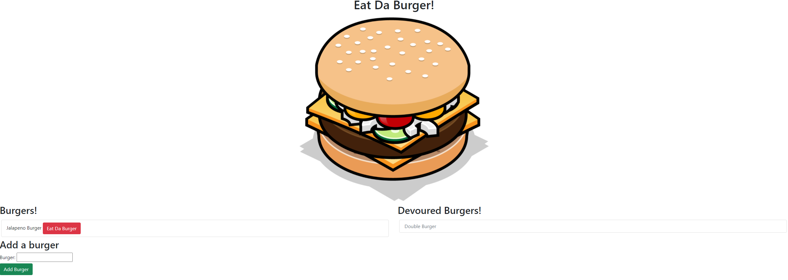

# 12_EatDaBurger

## Table of Contents

- [Description](#Description)
- [Installation](#Installation)
- [Usage](#Usage)
- [License](#License)
- [Contribution](#Contribution)
- [Tests](#Tests)
- [Questions](#Questions)

## Description

It is a web application that allows you to create/add burgers to the list in the database and then update them to be eaten.

## Screenshots

## Installation

you need to install express, mysql, and express-handlebars.

## Usage

you would go to the website and then type in the burger that you want to add to the list and the click the devour button if you want to eat it.

## License

## Contributing

You don't need to contrubute but if you want to you can email me.

## Tests

none

## Questions

- GitHub Username: [LoganPippin](github.com/LoganPippin)
- Email: logan.pippin32@gmail.com
